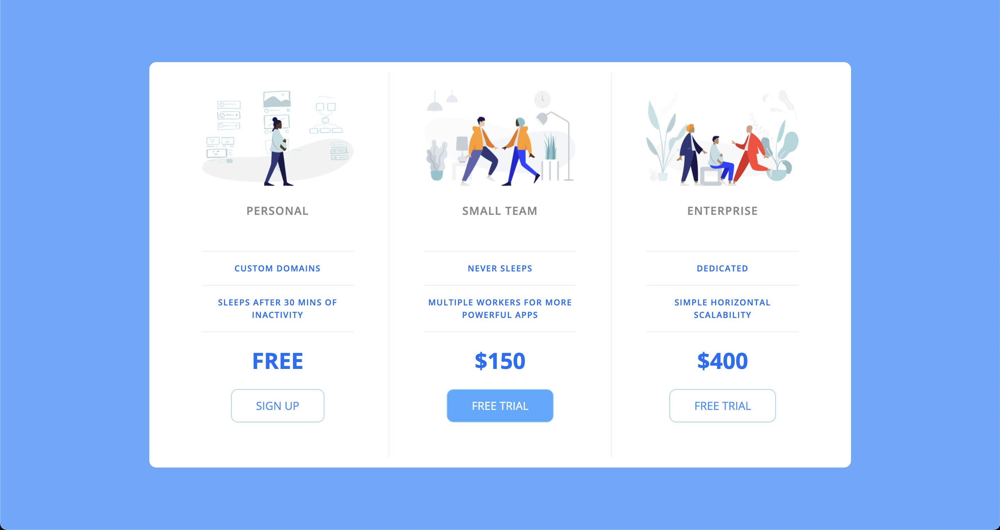

# Pricing Panel - School Project

## Table of contents

- [Screenshot](#screenshot)
- [Links](#links)
- [Built with](#built-with)
- [Author](#author)

### Screenshot



### Links

- Live Site:([Live Site](https://devtruce.github.io/pricing-panel/))

### Built with

- HTML5
- CSS3
- Flexbox

```html
<body>
  <div class="panel pricing-table">
    <div class="pricing-plan">
      
      <h2 class="pricing-header">Personal</h2>
      <ul class="pricing-features">
        <li class="pricing-features-item">Custom domains</li>
        <li class="pricing-features-item">
          Sleeps after 30 mins of inactivity
        </li>
      </ul>
      <span class="pricing-price">Free</span>
      <a href="#/" class="pricing-button">Sign up</a>
    </div>

    <div class="pricing-plan">
      
      <h2 class="pricing-header">Small team</h2>
      <ul class="pricing-features">
        <li class="pricing-features-item">Never sleeps</li>
        <li class="pricing-features-item">
          Multiple workers for more powerful apps
        </li>
      </ul>
      <span class="pricing-price">$150</span>
      <a href="#/" class="pricing-button is-featured">Free trial</a>
    </div>

    <div class="pricing-plan">
      
      <h2 class="pricing-header">Enterprise</h2>
      <ul class="pricing-features">
        <li class="pricing-features-item">Dedicated</li>
        <li class="pricing-features-item">Simple horizontal scalability</li>
      </ul>
      <span class="pricing-price">$400</span>
      <a href="#/" class="pricing-button">Free trial</a>
    </div>
  </div>
</body>
```

```css
html {
  font-family: "Open Sans", sans-serif;
  box-sizing: border-box;
  text-transform: uppercase;
}

body {
  background-color: #60a9ff;
  display: flex;
  justify-content: center;
  align-items: center;
  min-height: 100vh;
}

.panel {
  background-color: white;
  width: 100%;
  max-width: 960px;
  display: flex;
  flex-direction: column;
  border-radius: 10px;
  text-align: center;
  padding: 15px 25px;
}
.pricing-header {
  color: #888;
  font-weight: 600;
  letter-spacing: 1px;
}

.pricing-features-item {
  border-top: 1px solid #e1f1ff;
  color: #016ff9;
  font-size: 12px;
  font-weight: 600;
  padding: 15px 0;
  line-height: 1.5;
  letter-spacing: 1px;
}

.pricing-features-item:last-child {
  border-bottom: 1px solid #e1f1ff;
  border-width: 80%;
}

.pricing-features {
  margin: 50px 0 25px 0;
}

.pricing-price {
  color: #016ff9;
  font-weight: 700;
  font-size: 32px;
  display: block;
}

.pricing-plan {
  border-bottom: 1px solid #e1f1ff;
  padding: 25px 50px;
}

.pricing-button {
  color: #348efe;
  border: 1px solid #9dd1ff;
  border-radius: 10px;
  padding: 15px 35px;
  margin: 25px 0;
  text-decoration: none;
  display: inline-block;
}

.pricing-button:hover {
  background-color: #e1f1ff;
}

.pricing-button.is-featured {
  background-color: #48aaff;
  color: white;
}

.pricing-button.is-featured:hover {
  background-color: #269aff;
  transition: background-color 200ms ease-in-out;
}

.pricing-img {
  width: 100%;
  max-width: 100%;
  margin-bottom: 25px;
}

@media (min-width: 800px) {
  .panel {
    flex-direction: row;
  }

  .pricing-plan {
    border-bottom: none;
    border-right: 1px solid #e1f1ff;
  }

  .pricing-plan:last-child {
    border-right: none;
  }
}
```

## Author

- Frontend Mentor - [@DevTruce](https://www.frontendmentor.io/profile/DevTruce)
